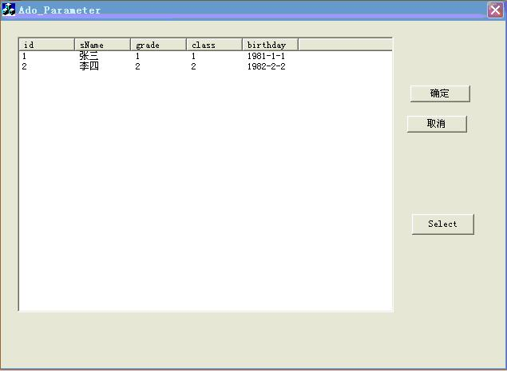

# [VC++ ADO参数查询](http://blog.chinaunix.net/uid-25958655-id-3961324.html)
## 1、首先在我的sql server 2005 express中有test数据库：的一张表
```sql
create table student

(

id int;

name varchar(10);

grade int;

class int;

birthday datetime;

primary key(id)

)
```
并有数据：
```sql
insert into student values(1,'张三',1,1,'1981-01-01 0:0:0');

insert into student values(2,'李四',2,2,'1982-02-02 0:0:0');

insert into student values(3,'王五',2,2,'1983-03-03 0:0:0');
```

## 2、万事开头难，任何一种新技术对于初学者来说最重要的还是“入门”，掌握其要点。让我们来看看ADO数据库开发的基本流程吧！
(1)初始化COM库，引入ADO库定义文件
(2)用Connection对象连接数据库
(3)利用建立好的连接，通过Connection、Command对象执行SQL命令，或利用Recordset对象取得结果记录集进行查询、处理。
(4)使用完毕后关闭连接释放对象。

### 一、新建一个MFC(.exe)工程,工程名Ado_Parameter，并按下一步在第二个页面选择基于对话框(Dialog based)的，完成。 然后在对话框设计页面加入一个列表控件(ListContrl ),设置它的”属性à查看à样式”为”排列”,并将列表控件CListCtrl m_ListCtrl成员相关联, 并加入一个”查询”按钮ID为”IDC_SELECT”.

### 二、用#import指令引入ADO类型库

　　为了引入ADO类型库，需要在项目的stdafx.h文件中加入如下（一行）#import语句：
```cpp
#import "c:\program files\common files\system\ado\msado15.dll" no_namespace rename("EOF","adoEOF")
```
 加在 //{{AFX_INSERT_LOCATION}}//这一行的上面一行就好, 如果是在VS2005中生成的VC项目就加在#ifdef _UNICODE这一行的上面,我有试过加在其它地方有的会出错 

　　这一语句有何作用呢？其最终作用同我们已经十分熟悉的#include类似，编译的时候系统会为我们生成msado15.tlh,ado15.tli两个C++头文件来定义ADO库,在工程所在的目录的debug目录下可看到这两个文件。

　　需要读者朋友注意的是：您的开发环境中msado15.dll不一定在这个目录下，请按实际情况修改；在编译的时候可能会出现如下警告，对此微软在MSDN中作了说明，并建议我们不要理会这个警告：msado15.tlh(405) : warning C4146: unary minus operator applied to unsigned type, result still unsigned。

 

### 三、COM库的初始化

　　我们可以使用AfxOleInit()来初始化COM库，这项工作通常在CWinApp::InitInstance()的重载函数中完成，请看如下代码:
  ```cpp
  BOOL CAdo_ParameterApp::InitInstance()
{
//初始化OLE DLLs
if(!AfxOleInit())
   {
    AfxMessageBox(_T("初始化OLE DLL失败!"));
    return FALSE;
   }
......
.....
}
```
### 四 然后就可以用3个智能指针了:_ConnectionPtr、_RecordsetPtr和_CommandPtr

  首先:在BOOL CAdo_ParameterDlg::OnInitDialog() 函数里面向m_ListCtrl加入列,通过这种方法来设置列数
  ```cpp
  BOOL CAdo_ParameterDlg::OnInitDialog()
{
    ………//原来就有的我就不复制了
   m_ListCtrl.InsertColumn(0,"id",LVCFMT_LEFT,70,0);
    m_ListCtrl.InsertColumn(1,"sName",LVCFMT_LEFT,70,1);
    m_ListCtrl.InsertColumn(2,"grade",LVCFMT_LEFT,70,2);
    m_ListCtrl.InsertColumn(3,"class",LVCFMT_LEFT,70,3);
    m_ListCtrl.InsertColumn(4,"birthday",LVCFMT_LEFT,70,4);


    return true;
}
```
### 我的”查询”按钮的消息响应函数如下:
```cpp
void CAdo_ParameterDlg::OnSelect() 
{
    // TODO: Add your control notification handler code here
    _ConnectionPtr pConn;
    _RecordsetPtr pRecordset;
    _CommandPtr pCmd;
    _ParameterPtr Param1;

    CString cError=" 1";    
    try
    {
        pConn.CreateInstance("ADODB.Connection");
        //_bstr_t strConnect="Provier=SQLOLEDB.1;User ID=sa;Password=123456; Server=127.0.0.1\\SQLEXPRESS; Initial Catalog=test;Persist Security Info=true";//SQL Server 的连接字串
        _bstr_t strConnect="Provider=SQLOLEDB.1;Server=127.0.0.1\\SQLEXPRESS;Password=123456;Persist Security Info=true;User ID=sa;Initial Catalog=test";//注127.0.0.1\\SQLEXPRESS改成T75JLZX6ILTGGAL\\SQLEXPRESS的话是肯定可以

        pConn->Open(strConnect,"","",adModeUnknown);//连接数据库
        cError=" 2";

    }
    catch(_com_error e)
    {
        AfxMessageBox(e.Description()+cError);
        return;
    }
    
    try
    {
        pRecordset.CreateInstance("ADODB.Recordset");
        pCmd.CreateInstance("ADODB.Command");
        
        //代码段1 使用birthday(datetime类型)查询
        pCmd->ActiveConnection=pConn;
        pCmd->CommandText=_bstr_t(_T("select * from student where birthday));
        // Create Parameter Object 创建参数对象
        Param1=pCmd->CreateParameter(_bstr_t(""), adDate, adParamInput, -1, _variant_t("1982-2-8 2:00:00"));
        pCmd->Parameters->Append(Param1); //给command 添加参数,如果有多个参数,注意添加的顺序
        //end of 代码段1

        //代码段2 使用id(int类型)字段查询
        //pCmd->CommandText=_bstr_t(_T("select * from student where id));
        //// Create Parameter Object
        //Param1=pCmd->CreateParameter(_bstr_t(""), adInteger, adParamInput, -1, _variant_t(long(3)));
        //pCmd->Parameters->Append(Param1);
        //end of代码段2
        

        //
        pRecordset->Open((IDispatch*)pCmd, vtMissing, adOpenStatic, adLockOptimistic, adCmdUnspecified);

        int i=0;
        while(!pRecordset->adoEOF)
        {
            m_ListCtrl.InsertItem(i,""); //刚开始忘了加入这一行,所以一直没有数据显示
            m_ListCtrl.SetItemText(i,0, (char *) (bstr_t)pRecordset->GetCollect("id"));
            m_ListCtrl.SetItemText(i,1, (char *) (bstr_t)pRecordset->GetCollect("sname"));
            m_ListCtrl.SetItemText(i,2, (char *) (bstr_t)pRecordset->GetCollect("grade"));
            m_ListCtrl.SetItemText(i,3, (char *) (bstr_t)pRecordset->GetCollect("class"));
            m_ListCtrl.SetItemText(i,4, (char *) (bstr_t)pRecordset->GetCollect("birthday"));
            
            i++;
        /span;    pRecordset->MoveNext();
        }
        pRecordset->Close(); //用完后关闭并且释放
        pConn->Close();
        pCmd.Release();
        pRecordset.Release();
        pConn.Release();
    }
    catch(_com_error e)
    {
        AfxMessageBox(e.Description());
        return;
    }
}
```
代码段1和代码段2分别示例了两种字段类型的参数写法.
### 运行结果可是有数据的,运行结果如图:

### 转:  孙鑫VC++深入详解教程 第20章最后一讲数据库的
http://blog.chinaunix.net/uid-25958655-id-3955222.html
http://blog.chinaunix.net/uid-25958655-id-3949738.html 
http://www.yesky.com/413/1839913_2.shtml 
http://www.xinfengit.com/200907/2167363.html
